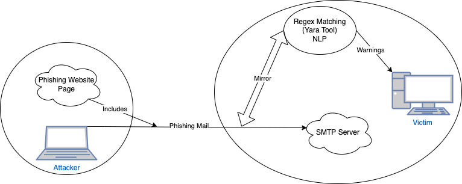
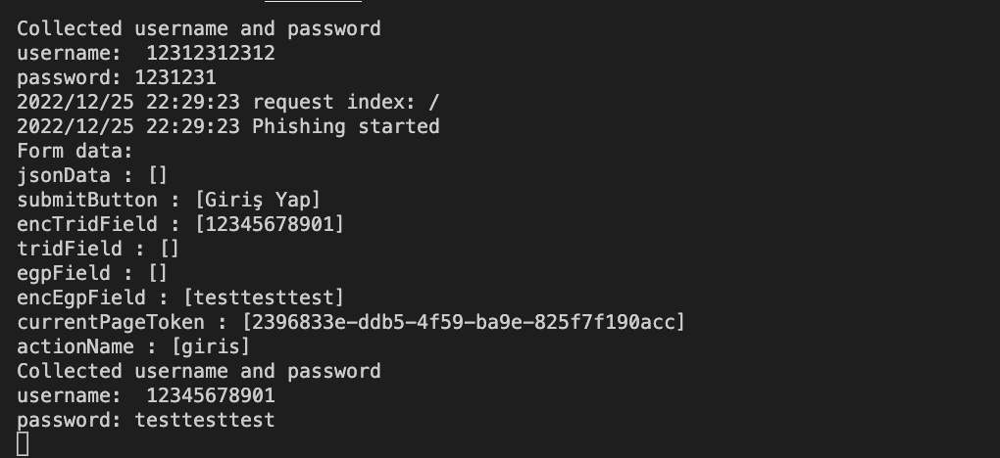
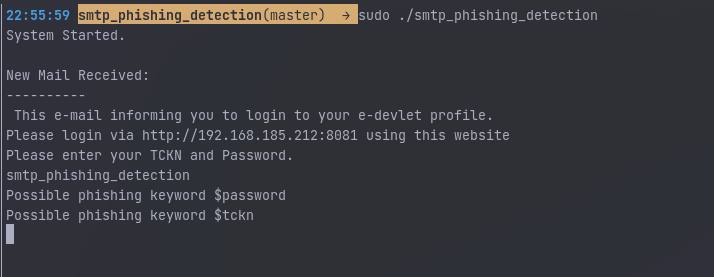
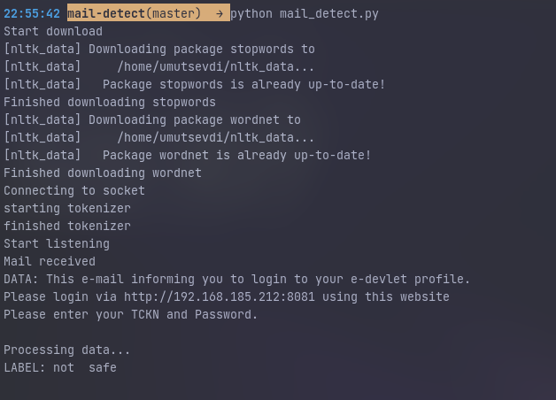

<p align="center">
  <a href="https://github.com/umutsevdi/pds">
  <h3 align="center">Phishing Detection System</h3>
  </a>

<p align="center">  
Machine Learning and Regex Matching based Phishing Detection System with a phishing attack scenario
  <br/>
    <i>Developed by <a href="https://github.com/umutsevdi">Umut Sevdi</a>, 
<a href="https://github.com/ismetgngr">İsmet Güngör</a>,
<a href="https://github.com/semihyazici">Semih Yazıcı</a> and 
<a href="https://github.com/Oguzhanercan">Oğuzhan Ercan</a></i>
<p align="center"><a href="doc/Report.pdf"><strong>Explore the docs »
</strong></a></p>

<details open="open">
  <summary>Table of Contents</summary>
  <ol>
    <li><a href="#project_definition">Project Definition</a></li>
    <li><a href="#system_architecture">System Architecture</a></li>
    <li><a href="#hardware">Hardware Requirements</a></li>
    <li><a href="#installation">Installation</a></li>
    <li><a href="LICENSE">License</a></li>
    <li><a href="#contact">Contact</a></li>
  </ol>
</details>


<p id="project_definition">

## 1. Project Definition

Phishing is a cyber attack involving carefully crafted emails or websites to trick
individuals into revealing sensitive information such as login credentials or financial
information. These attacks often take the form of fake login pages or emails purporting
to be from legitimate organizations, and they can have severe consequences for both
individuals and organizations.


<p align="center"></p>

In our project, we developed a phishing scenario and a program to protect from it. In
the scenario, we hosted an SMTP server and a phishing server for the attacker. Phishing 
server tricks users into thinking that the website is legit.

When the victim clicks on the link, a login page that imitates "edevlet.gov.tr" is returned.
However, when the user logs in, all credentials are sent to the attacker. Phishing site
responds with a fake dashboard to be unnoticed.

Against similar attacks, we aimed to develop a machine learning and a regex
matching-based phishing detection system to identify and prevent phishing
attacks. The use of machine learning algorithms and regex matching allows the system to
analyze and classify email content and identify patterns and keywords commonly used in
phishing attacks. This approach has the potential to be highly effective in detecting
and preventing phishing attacks, as it can quickly and accurately identify suspicious
emails and take action to block them.

<p id="system_architecture">

## 2. System Architecture

### Attacker
* On the attacker's side, we developed a web server in Go to host the phishing site. The site sends
a web page that looks like edevlet.gov.tr. However, unlike the original page, it does not encrypt
any data while sending. And it sends directly to the attacker.

<p align="center"></p>

#### Victim
* We used a [MailHog](https://github.com/mailhog/MailHog) server to host an SMTP server. It runs
from a docker-compose file as a container for testing purposes.

* To protect the victim against phishing attacks, we have implemented a system that listens to
the ongoing traffic and parses SMTP to examine the mail body. After obtaining the mail body,
firstly process with [Yara](https://virustotal.github.io/yara/) using rules specifically
generated for detecting phishing mail attacks.
After checking possible malicious keywords with the Yara tool, transferring the plain text
body to a Python program, a machine learning method that determines whether the incoming
mail is a phishing attack or innocent.

<p align="center"></p>

* We have called Long Short Term memory, a type of recurrent neural network (RNN)
well-suited for modeling long-term dependencies in time series or sequential data. It can
effectively retain information over long periods and handle variable-length input sequences.
The attention layer weighs the input sequences, and the classifier predicts based on the
weighted input. The model also has methods for generating initial hidden states for the LSTM
layer, encoding input text using the embedding layer and LSTM layer, and applying attention
to the output of the LSTM layer. In addition, we detect which words cause phishing thanks to
the attention layer placed between LSTM and linear classifiers in the model.
The text that came over TCP and converted to the string was not in a format that could be fed
into our LSTM model. For this reason, we performed the text preprocessing steps frequently
used in natural language processing tasks. The `utils_preprocess_text` function is used for
cleaning and preprocessing text by removing punctuation and lower-casing, removing stop
words, and optionally applying stemming or lemmatization. The `textCleaner` function applies
the `utils_preprocess_text` function to a column of a pandas DataFrame and stores the
processed text in a new column.

<p align="center"></p>


<p id="installation">

### 3. Installation

Requirements: 
* [Yara v4](https://github.com/hillu/go-yara/v4)
* [nltk](https://www.nltk.org/)
* Numpy
* Pandas
* Docker and docker-compose

1. Clone the repository.

```sh
   git clone https://github.com/umutsevdi/pds.git
```

2. Run the mail server.
   

```sh
    cd victim
    docker-compose up
```

3. Compile and execute the Phishing detection programs.

```sh
    cd victim 
    cd mail-detect 
    python mail_detect.py &
    cd ..
    go build smtp_phishing_detection
    sudo smtp_phishing_detection/smtp_phishing_detection &
```

4. Execute the attacker programs from an external device or locally.

```sh
    cd attacker/phishing_server/cmd
    go run . &
```

5. Now you can send phishing emails using our mail script.
```sh 
    cd attacker/
    pyhton mail_sender.py
```

## 5. License

Distributed under the MIT License. See `LICENSE` for more information.

<p id="contact">

## 6. Contact

You can contact any developer of this project for any suggestion or information.

Project: [umutsevdi/pds](https://github.com/umutsevdi/pds)

<i>Developed by <a href="https://github.com/umutsevdi">Umut Sevdi</a>, 
<a href="https://github.com/ismetgngr">İsmet Güngör</a>,
<a href="https://github.com/semihyazici">Semih Yazıcı</a> and 
<a href="https://github.com/Oguzhanercan">Oğuzhan Ercan</a></i>
